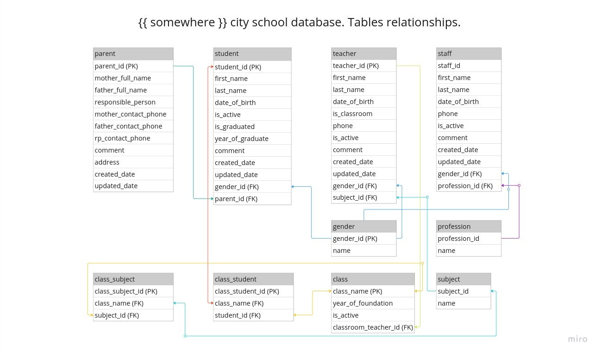

# Django ORM training
App contains:
- Related Sqlite3 db tables with data
- Default admin app to manage data
- Tables relationships schema:
Task:
- Improve the app:
  - Add templates that shows different school information (about students, teachers, staff...)
  - Implement new app to monitor students progress.
  - Expand the scheme. You can add "Management" table and others.
- 

## Installation
```git clone```

```poetry install```

```make runserver```

## Admin panel:

```127.0.0.1:8000/admin```

## Credentials:

```admin```

```admin```