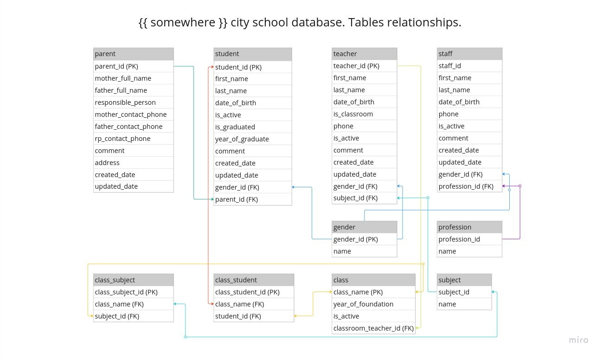

# HIGH SCHOOL OF SOMEWHERE CITY
This study project has implemented for practice and master django, django orm, raw sql.
The application helps keep records of high school staff and students.

This release have:
- Sqlite3 database with related tables and data containing information of students, classes, teachers, parents, management, staff and messages.
  * All matches of names and addresses are random. Data was taken from MySQL open database named sakila.  
- Default django administration
- Permissions:
  - The app is available only to users. Visitors without authentication can not view the website.
  - Teachers are high level staff, they can view the application, but can not manage and change data in administrative panel.
  - Each person in management staff can make CRUD operations with own area of responsibility.
  - Management staff and admin are included to Management group, that can public any information at home page.
- Default Django templates showing necessary information
- Bootstrap styles


Next releases will have: 
- Redis caching
- API
- Django's templates will be changed to really front-end using vue.js or another js framework. 
- Test cases

## The project structure
source: source root directory
  - apps: contains apps
    - main: main app package
  config: the project's configuration package
    - env.template contains project's credentials examples

## DB SCHEMA


## Initialization
```git clone <repository_url>```

```poetry install && poetry shell```

```make runserver```
